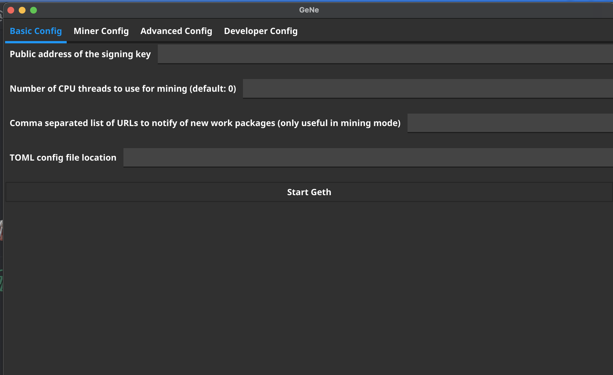
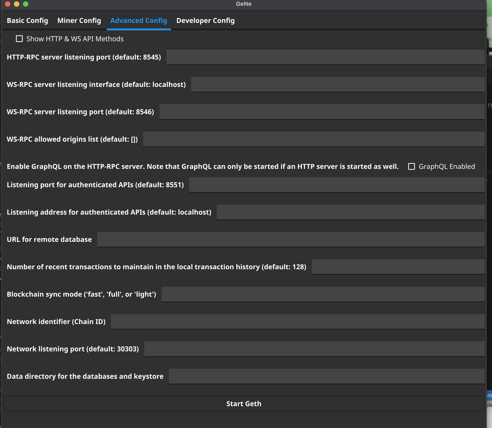
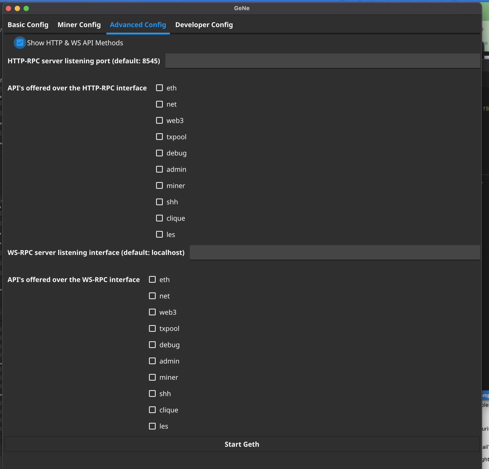
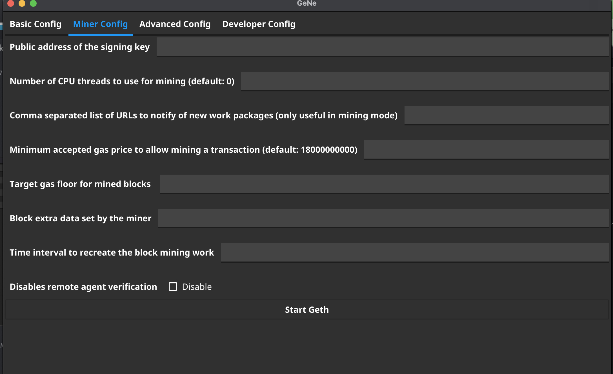
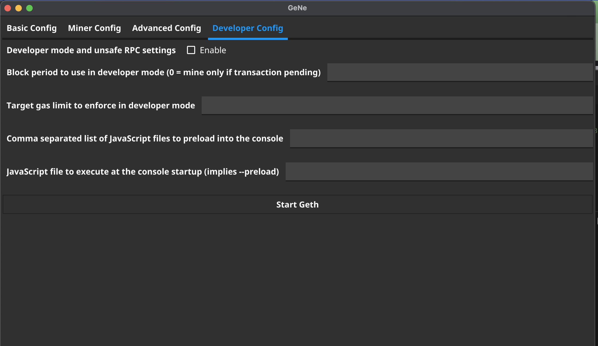

# GeNe

Geth + Fyne = GeNe

## Introduction 

I wanted to learn/play with [Fyne](https://developer.fyne.io/) so I decided to make a simple interface for interaction with Geth clients... I wrote this front to back in about 6 hours. So this is super simple code & functionality (I.E. dont expect anything crazy just yet. )


## Usage

### Setup / Configuration
There is an osx build of the Ethereum `go-ethereum` client bundled with this repository at the root directory. 

IF you are on osx, you can launch `GeNe` with no configuration. 

IF you would prefer to use another `geth` client simply download the client and replace it with the one located in the root of this repository. 

IF you would prefer for your `geth` binary to live in another path:

Export the full path to this file as `GETH`

For example. if you have the `go-ethereum` repo checked out in your `gopath` and you built `geth` from there.

Your export might look like this:
```
export GETH=/home/user/go/src/github.com/ethereum/go-ethereum/cmd/geth/geth
```


### Building & Running 

From the root of this repository, execute the following:

```
go run cmd/main.go
```

### Feedback / Contribution 

Please do :) 

### UI Screenshots







